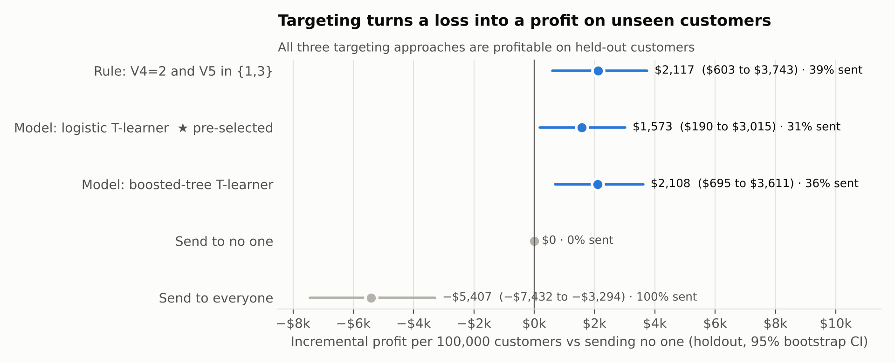
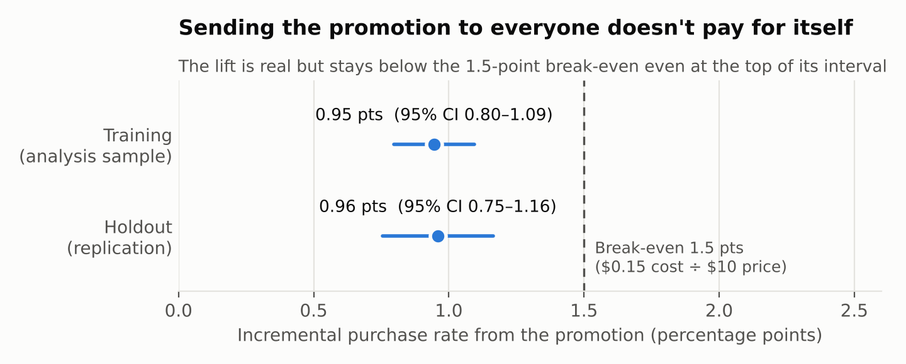
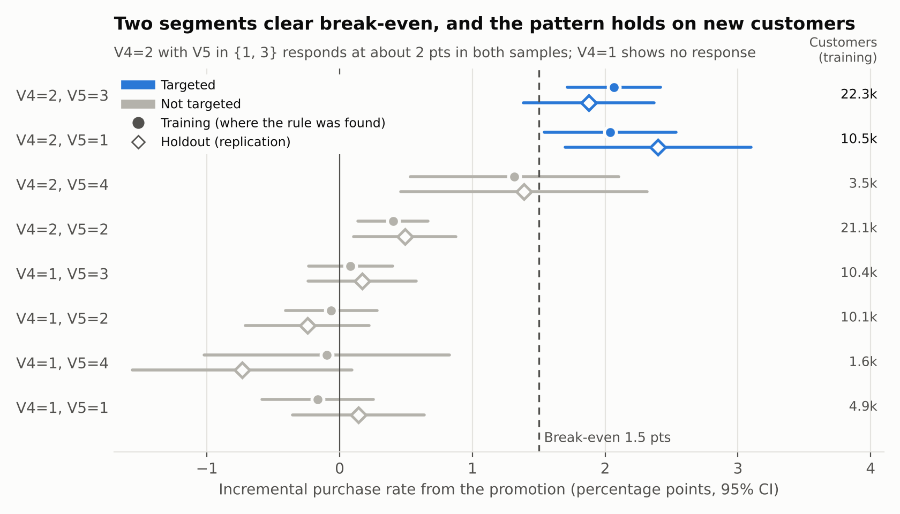

# Starbucks Promotion Targeting

This is an end-to-end analytics project that uses a randomized promotion experiment to decide who should receive a promotion, using Python, SQL, a YAML-defined metric layer, and scikit-learn. The project demonstrates a senior analyst workflow, including pre-registered decision rules, a tested metric layer, experiment validity checks, uplift-based targeting evaluated on a holdout, and a stakeholder-facing recommendation memo.

## Business Question

Starbucks tested a promotion for a $10 product. Each promotion costs $0.15 to send.

**Should the promotion go to everyone, to no one, or only to customers likely to respond?**

The promotion only pays for itself if it raises purchase probability by more than:

```text
$0.15 cost per send ÷ $10 per purchase = 1.5 percentage points
```

This break-even threshold is the bar for every decision in the project. Statistical significance alone is not enough.

## Recommendation

| | |
|---|---|
| **Decision** | Stop sending the promotion to everyone. Send it only to customers with **V4=2 and V5 in {1, 3}** (about 39% of the base). |
| **Why** | The promotion lifts purchases by **0.95 points** (95% CI 0.80 to 1.09), below the 1.5-point break-even. The targeted segment responds at **2.05 points** (CI 1.64 to 2.45). |
| **Impact** | Sending to everyone loses about **$5,400 per 100k customers**. Targeting earns about **+$2,100 per 100k** (CI +$600 to +$3,700) on held-out customers and sends about 60% fewer promotions. |
| **Key risk** | The $10 is price, not margin. If an extra sale is worth less than **$7.33**, even the targeted send loses money. |
| **Next step** | Confirm margin, then roll out to the targeted segment with a 10% unpromoted control group (about 20,700 customers to confirm the lift). |

The full recommendation is in the one-page memo: [`memo/memo.md`](memo/memo.md)



## Analysis Workflow

```text
Experiment brief
(question • break-even • decision rules)
       │
       ▼
Raw experiment data
(training.csv • Test.csv)
       │
       ▼
Staging model (SQL)
(one row per customer • data tests)
       │
       ▼
Metric layer (YAML)
(every metric defined once)
       │
       ▼
Validity checks
(sample ratio • covariate balance)
       │
       ▼
A/B inference
(lift • confidence intervals • dollars)
       │
       ▼
Targeting
(policies chosen by cross-validation on training only)
       │
       ▼
Holdout evaluation
(scored once • bootstrap intervals)
       │
       ▼
Recommendation memo
```

## Data Model

| Source | Rows | Role |
|---|---|---|
| `training.csv` | 84,534 | Analysis sample: A/B inference, exploration, model fitting, cross-validation |
| `Test.csv` | 41,650 | Holdout: final policy evaluation only |

Both files come from the same randomized experiment. Each customer was randomly assigned to receive the promotion (`Promotion = Yes`) or not (`No`), and `purchase` records whether they bought. Features `V1` through `V7` are anonymized.

### Staging Model

`metrics/models/stg_customers.sql`

**Grain:** One row per customer.

The staging model unions both files, tags each row's split, and standardizes column names and types. The loader reads only the ten documented columns, which drops stray spreadsheet columns found in `Test.csv`.

## Metric Layer

Every metric in the project is defined once in [`metrics/metrics.yml`](metrics/metrics.yml). The analysis asks the metric layer for metrics by name and never recalculates them on its own.

[`metrics/layer.py`](metrics/layer.py) builds the staging model, runs data tests, and compiles metric requests into SQL.

### Metrics

| Metric | Definition |
|---|---|
| `purchase_rate` | Purchases divided by customers |
| `promotion_purchase_rate` | Purchase rate among customers sent the promotion |
| `control_purchase_rate` | Purchase rate among customers not sent the promotion |
| `incremental_response_rate` | Promotion purchase rate minus control purchase rate |
| `break_even_irr` | Cost per promotion divided by revenue per purchase (1.5 points) |
| `net_value_per_send` | $10 × incremental response rate − $0.15 |
| `net_incremental_revenue_per_100k` | Net value per send, scaled to 100,000 customers |
| `sample_ratio` | Share of customers assigned to the promotion |

Each metric in the YAML file also carries a `why` field explaining its role in the decision.

### Data Tests

The metric layer runs these tests before any analysis:

| Test | Purpose |
|---|---|
| `customer_id_unique` | No duplicate customers |
| `arm_not_null` / `arm_accepted_values` | Every customer is in exactly one valid arm |
| `purchased_is_binary` | Outcome is 0 or 1 |
| `no_null_features` / `features_in_range` | Features are present and inside their documented ranges |
| `customer_in_one_split` | No customer appears in both training and holdout |
| `splits_present` | Both samples loaded |

### Example Query

```bash
python -m metrics.layer query incremental_response_rate net_value_per_send --dims v4,v5 --where "split='training'"
```

To see the compiled SQL behind a metric:

```bash
python -m metrics.layer sql net_value_per_send --dims split
```

The SQL is portable across SQLite, DuckDB, and Snowflake. The YAML follows the structure of a dbt semantic model (measures, dimensions, ratio and derived metrics), so the definitions can move to dbt without changing.

## Key Analytical Decisions

### Decide on Profit, Not Significance

The promotion's lift is highly significant (p < 0.001), but significance only shows the promotion does something. The decision depends on whether the lift is large enough to cover the cost of each send.

Every result is therefore compared against the 1.5-point break-even and converted into dollars per 100,000 customers.

---

### Write the Decision Rules Before Looking at the Data

The question, metrics, validity checks, and decision rules were committed in [`brief/brief.md`](brief/brief.md) before the data was downloaded.

Any change made afterwards is logged in the brief's changelog with the reason and whether it was made before or after results.

---

### Check Validity Before Estimating Effects

An experiment result is only trustworthy if randomization worked.

Before estimating any effects, the analysis checks:

1. Sample ratio between promotion and control (χ² test)
2. Balance of V1 to V7 across arms (standardized mean differences)
3. Data quality through the metric layer's tests

All checks passed on both samples.

---

### Keep the Holdout Untouched

Searching across segments for one that responds can find a segment that only looks good by chance.

To prevent this:

- Segment exploration, model fitting, and policy selection use only the training data
- The holdout is scored once, after the policy is chosen
- The segment results are shown on both samples so the replication is visible

---

### Choose Between Policies With Cross-Validation

Three targeting policies were compared using 5-fold cross-validated profit on training data:

- A rule based on V4 and V5 segments
- A logistic regression T-learner
- A gradient-boosted tree T-learner

The logistic model won by $55 per 100k, which is within fold-to-fold noise. It is the policy scored against the brief's decision rule, and it meets that rule.

---

### Recommend the Simpler Rule

The memo recommends the V4/V5 rule over the model. This is a judgment call made after seeing the results, and it is logged in the brief's changelog.

The reasoning:

- The rule and the model were indistinguishable in cross-validation
- 94% of the model's targeted customers are inside the rule
- The rule picked the same segments in 4 of 5 folds
- The rule can be explained in one sentence and needs no model in production

---

### Test the Recommendation Against Its Own Assumptions

The recommendation depends on assumptions the experiment can't verify, so the analysis checks how much they matter:

- **Value per sale:** the targeted send breaks even at $7.33 per extra sale
- **Cost per send:** targeting stays profitable up to about $0.20 per send
- **Excluded customers:** the customers the rule leaves out respond at only 0.28 points, so excluding them is correct
- **Rollout sizing:** about 20,700 targeted customers are needed to confirm the lift in production

## Results

### Sending to Everyone Doesn't Pay for Itself



### The Response Is Concentrated in Two Segments



## Setup and Reproducibility

### Prerequisites

To run the project, you need:

* Python 3.10+
* Git
* Make

The repository does not contain the raw dataset. It is downloaded from its public source in step 3.

### 1. Clone the Repository

```bash
git clone https://github.com/ShawnR2424/starbucks.git
cd starbucks
```

### 2. Create the Python Environment

```bash
python3 -m venv .venv
source .venv/bin/activate
pip install -r requirements.txt
```

### 3. Download the Data

```bash
make data
```

This downloads `training.csv` and `Test.csv` into `data/`.

### 4. Run the Analysis

```bash
make all
```

This builds the metric layer, runs the data tests, runs the full analysis, and renders the figures.

The pipeline writes:

* `analysis/outputs/results.json`: every number used in the memo
* `analysis/outputs/segment_lift.csv`: lift by V4 × V5 segment on both samples, with confidence intervals
* `memo/figures/`: charts used in the memo and README

Random seeds are fixed, so repeated runs produce identical results.

## Data and Version Control

The dataset originated from a Starbucks take-home assessment and has no stated license, so the raw CSV files are excluded from Git:

```text
data/*.csv
```

The repository contains only the download script, derived aggregates, and charts.

## Project Status

**Status:** Complete portfolio project

The current implementation supports:

* Pre-registered experiment brief with decision rules and a changelog
* YAML-defined metric layer compiled to SQL
* Data tests run before analysis
* Experiment validity checks
* A/B inference with confidence intervals converted into dollars
* Cross-validated targeting policy selection
* Single-use holdout evaluation with paired bootstrap intervals
* Sensitivity analysis on the recommendation's key assumptions
* A one-page stakeholder memo

## What I Learned

This project was designed to practice the responsibilities of a senior analyst rather than simply run a statistical test.

Key areas of development included:

* Framing an experiment around a business decision instead of a p-value
* Defining break-even and decision rules before seeing results
* Separating metric definitions from the analysis that uses them
* Checking experiment validity before trusting an effect
* Protecting a holdout from selection bias when searching for responsive segments
* Being transparent about judgment calls made after seeing results
* Testing a recommendation against its own assumptions
* Writing a recommendation a non-technical stakeholder can act on

## Current Limitations

Current limitations include:

* Features V1 to V7 are anonymized, so the analysis can identify who responds but not why.
* The $10 value per purchase is the product price, not its margin.
* Purchases are rare (about 1%), so profit estimates have wide intervals.
* The holdout comes from the same test period, so it validates on new customers but not on a future period.
* The data records one purchase outcome per customer and does not capture promotion fatigue, full-price cannibalization, or long-term behavior.
* The metric layer runs on SQLite rather than a production warehouse.

## Future Improvements

Potential extensions include:

* Port the metric layer to a dbt semantic layer on DuckDB or Snowflake
* Run the data tests and analysis in CI on every commit
* Add a margin input so the recommendation updates with real unit economics
* Design a follow-up test for the borderline V4=2, V5=4 segment
* Build a monitoring view for the rollout's control group
* Compare additional uplift approaches, such as class transformation and causal forests

## Data Source

Starbucks take-home assessment data, via [01KAT1/Marketing-Promotion-Campaign-Uplift-Modelling-Starbucks-Dataset](https://github.com/01KAT1/Marketing-Promotion-Campaign-Uplift-Modelling-Starbucks-Dataset).
